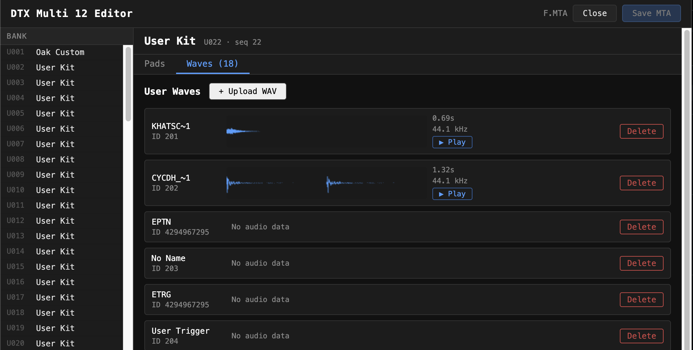

# DTX Multi 12 Editor



A browser-only editor for Yamaha DTX Multi 12 backup files (`.MTA`). Load a backup, inspect all 200 kit slots, view and edit voice settings per pad, manage user wave files, and export a modified backup — no server, no install, all parsing runs in-browser.

## Running

```bash
cd web
npm install
npm run dev      # dev server at http://localhost:5173
npm run build    # production build → dist/
```

Requires Node.js 18 or 19. (Vite 5 is pinned for Node 19 compatibility.)

## What it does

### Load a backup

Drag and drop `F.MTA` onto the drop zone, or click to open it. The file is parsed entirely in-browser using `DataView` — nothing is uploaded anywhere.

### Browse the bank

The left panel lists all 200 user kit slots (`U001`–`U200`). Named (non-empty) slots are highlighted. Click any slot to inspect it.

### Pad table

The **Pads** tab shows every voice entry in the selected kit, grouped by pad number. For each entry:

| Column | Description |
|--------|-------------|
| Pad | 0-based pad index (0–13) |
| Zone | Trigger zone (head, rim, HH-closed, etc.) |
| MIDI Note | Output MIDI note, shown as name and number (e.g. `C1 / 36`) |
| Vel Limit | Upper velocity limit (0–127) |
| Volume | Output volume (0–127) |
| Pan | Stereo pan (0=L, 64=C, 127=R) |
| Sends | Five effect send levels |
| Flags | Articulation flags (HH open, HH close, cymbal, etc.) |

**Volume**, **Pan**, **Vel Limit**, and **MIDI Note** are inline-editable: click the value, type a new number (0–127), press Enter to commit.

> **Note:** Voice selection (which sound plays — e.g. "Kk 1 Oak Custom") is not yet editable. The encoding of voice category + number within the kit block is still unknown. Contributions welcome.

### Wave manager

The **Waves** tab lists all user wave files stored in the backup. Each entry shows the filename, a waveform preview drawn on a canvas, duration, and sample rate. Click **Play** to audition via the Web Audio API.

**Upload WAV**: click `+ Upload WAV` to import a WAV file. Requirements:
- 16-bit PCM (no compressed formats)
- 44100 Hz sample rate (the DTX Multi 12 only supports 44.1 kHz)
- Mono (1 channel)

Files that don't meet these criteria are rejected with a descriptive error. The filename is truncated to 8.3 DOS format automatically.

**Delete**: click Delete on any wave row to remove it from the backup.

### Save MTA

Once you've made changes, **Save MTA** becomes active (marked with `*`). Click it to download the modified backup file. For voice edits, bytes are patched directly into the original buffer at their known offsets. For wave additions or deletions, the EWAV and DWAV chunks are rebuilt from scratch and the chunk directory is updated.

Reload the saved file on the device using the DTX Multi 12's USB backup restore function.

## How it works

### File format (YSFC)

The `.MTA` file is a YSFC container. A chunk directory at offset `0x80` maps 4-character chunk IDs to absolute file offsets. Relevant chunks:

| ID | Contents |
|----|----------|
| `EKIT` | Kit entry table — 200 × 32-byte records with name, index, seq ID |
| `DKIT` | Kit data — 3872-byte blocks, one per kit, containing voice entries |
| `EWAV` | Wave entry table — filename, size, offset, seq ID per user wave |
| `DWAV` | Wave data — 64-byte header + raw 16-bit big-endian PCM per wave |

### Voice entries

Each kit block contains up to ~82 voice entries in the range `0x154`–`0x9A7`. Entries are 26 bytes and start with the marker byte `0x7C`. Fields at known offsets encode pad number, zone type, velocity limits, MIDI output note, volume, pan, effect routing, and send levels. Voice selection (sound category/number) is not yet decoded.

### Binary parsing

All parsing uses `DataView` for explicit endianness control. The original `ArrayBuffer` is kept as `raw` throughout the session. Voice edits patch specific byte offsets directly. Wave changes rebuild the affected chunks and splice a new buffer together, updating the chunk directory offsets for any chunks that follow.

### PCM encoding

User wave PCM is stored as 16-bit big-endian signed integers at 44100 Hz mono. The parser byte-swaps to native-endian `Int16Array` for playback. The writer byte-swaps back before embedding in the DWAV chunk.

## Source layout

```
src/
├── parser/
│   ├── types.ts   — shared TypeScript interfaces
│   ├── mta.ts     — top-level parser: validates YSFC magic, reads chunk directory
│   ├── ekit.ts    — EKIT entry table parser
│   ├── dkit.ts    — DKIT kit block parser + voice entry scanner
│   ├── ewav.ts    — EWAV entry table parser
│   └── dwav.ts    — DWAV PCM decoder; encodeBigEndianPcm() for writing
├── writer/
│   └── mta.ts     — writeMta() (patch-in-place) + writeMtaWithWaveChanges() (chunk rebuild)
├── utils/
│   ├── midi.ts    — noteNumberToName(), noteLabel()
│   └── wav.ts     — readWavFile(), encodeAsBigEndianPcm(), toDosFilename()
└── components/
    ├── DropZone.tsx     — drag-and-drop file loader
    ├── BankView.tsx     — 200-slot kit list
    ├── KitView.tsx      — kit header + Pads/Waves tabs
    ├── PadTable.tsx     — voice entry table with inline editing
    ├── WaveManager.tsx  — wave list, upload, delete
    └── Waveform.tsx     — canvas waveform + Web Audio playback
```
